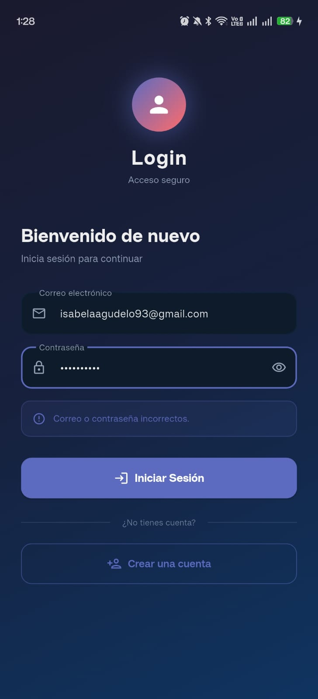
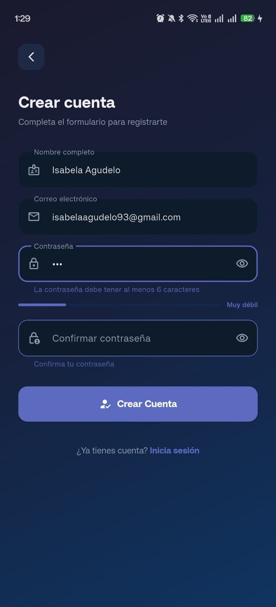
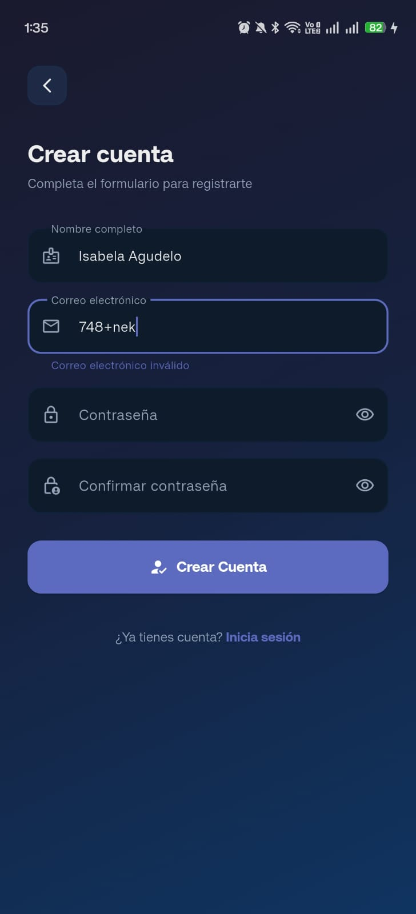
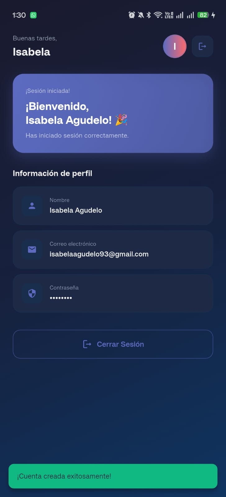
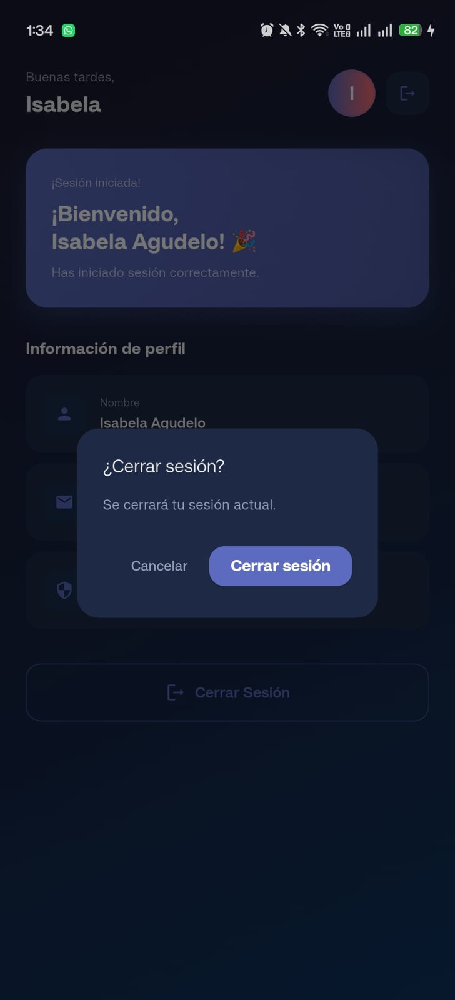
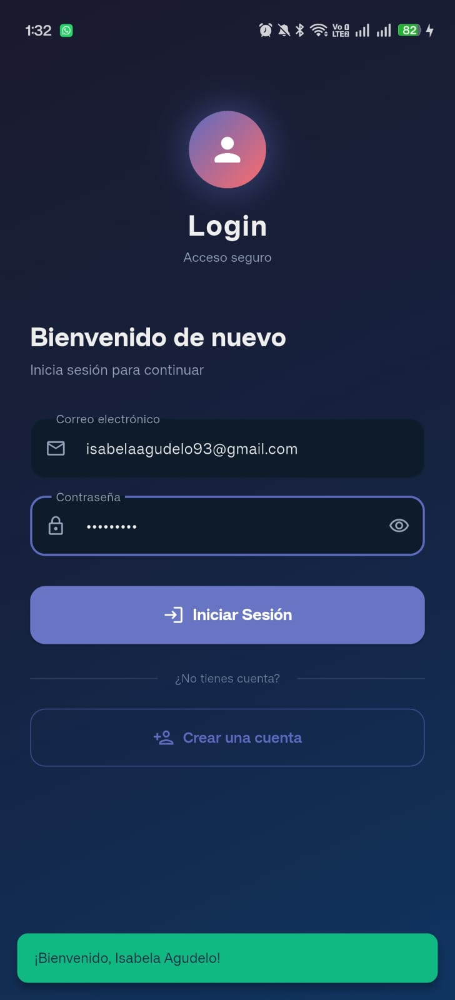

# App Login Flutter

## Descripción

Aplicación Flutter desarrollada para la actividad del capítulo 2.  
La aplicación permite el registro de usuarios, validación de datos e inicio de sesión.

---

# Funcionamiento de la Aplicación

## Pantalla de Login

En esta pantalla el usuario puede ingresar su correo y contraseña para iniciar sesión.

Si el usuario aún no tiene una cuenta registrada, podrá seleccionar la opción:
"¿Aún no tengo cuenta?"



---

## Pantalla de Registro

En la pantalla de registro se solicitan los siguientes datos:
- Nombre
- Correo electrónico
- Contraseña
- Confirmación de contraseña

La aplicación valida:
- Que el correo tenga un formato válido
- Que las contraseñas coincidan
- El nivel de seguridad de la contraseña

Además, se muestra al usuario si la contraseña es:
- Débil
- Media
- Fuerte






---

## Pantalla Home

Una vez creada la cuenta e iniciado sesión correctamente, el usuario es dirigido a la pantalla principal (Home).

En esta pantalla se muestra la opción de cerrar sesión.




---

## Verificación del Inicio de Sesión

Después de cerrar sesión, se regresa nuevamente al Login para verificar que la cuenta creada funciona correctamente.

Al ingresar nuevamente las credenciales registradas, el inicio de sesión se realiza con éxito.



---

# Ejecución del Proyecto

```bash
flutter pub get
flutter run
